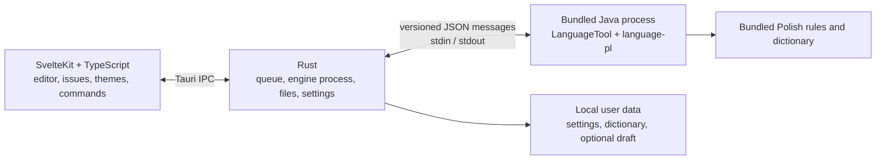

**Local Polish Proofreading App — Plan — 17 September 2026**

> **Instruction for future agents:** This application is specifically for proofreading **Polish** (`pl-PL`). Treat Polish spelling, punctuation, grammar, inflection, diacritics, Unicode behavior, and Polish keyboard input as core product requirements. Use Polish examples and a Polish-language quality corpus for linguistic implementation and evaluation. User-facing copy and sample text should be in Polish. English is the planning and development-documentation language; it does not change the application's target language.

Recommendation: **SvelteKit + TypeScript + Tauri 2 + the Polish LanguageTool module bundled with a trimmed Java runtime**. Version 1.0 should check spelling, missing and unnecessary commas, and selected grammar errors. Its distinguishing qualities are privacy, fast keyboard-driven use, and a carefully polished interface using JetBrains Mono.

This is a specification and delivery plan, not an implementation already in progress. The performance figures below are targets to validate, and the schedule is an estimate. No local LanguageTool benchmarks or measurements of a finished installer have been run yet.

**1. Product promise and version 1.0 scope.** A user downloads one installer for their computer, opens the app, pastes text, and checks it. They do not install Java, create an account, configure a server, or provide an API key. The engine and Polish language data are bundled. Checking works offline.

The primary workflow is: **paste → check → navigate to an issue → accept or ignore → copy the text**. The entire workflow must work without a mouse. The editor remains usable while the engine starts and analyzes text.

The no-issues message is “Nie znaleziono błędów” (“No errors found”). A result is not a guarantee of perfect language correctness. The app distinguishes a replacement suggestion from a warning without a ready-made fix; the latter also applies to comma issues.

| Scope | Version 1.0 | Later |
|---|---|---|
| Proofreading | Spelling, punctuation, selected grammar rules; category filters; short explanations | Optional style suggestions and custom rules |
| Editing | One plain-text document; paste; open and save UTF-8 TXT; undo and redo | Multiple documents, Markdown, other formats |
| Suggestions | Underlines, issue list, change preview, apply one fix, ignore an occurrence | Carefully designed bulk operations |
| Proofreading preferences | User dictionary, remove entries, disable a specific rule in settings | Import larger dictionaries and rule profiles |
| Keyboard | Local shortcuts, command palette, remapping, optional global shortcut to show the window where supported | Global “check clipboard”, Wayland portal integration |
| Appearance | JetBrains Mono, light/dark/system appearance, three palettes, focus mode, micro-animations | More palettes, export settings |
| Data | Local settings and dictionary; optional remember-last-draft setting | Document history and search |
| Distribution | macOS, Windows, and defined Linux distributions; signed releases; user-initiated update checks | More architectures and a beta channel |

Version 1.0 does not include an LLM, cloud services, accounts, sync, PDF/DOCX, or rich-text editing. Each would significantly expand scope. Style is separate from errors: a style suggestion should not increase the spelling-error count.

**2. Engine choice and first technical decision.** LanguageTool is the starting point because of its contextual Polish rules, including comma rules. A word list alone cannot meet this requirement. The local edition does not require a subscription or per-check fee, but it does not include every feature of the commercial Premium service. [LanguageTool local server documentation](https://dev.languagetool.org/http-server).

As of the date of this plan, Maven Central lists `language-pl:6.8` as the latest published release. It is a candidate for testing, not an automatically approved version. Evaluate it against the 2026 Polish spelling standard and a corpus of Polish sentences. If a needed fix exists only in newer source, choose a verified commit with a documented change or wait for a release. Always pin the exact version and checksums in production builds. [Release metadata](https://repo.maven.apache.org/maven2/org/languagetool/language-pl/maven-metadata.xml), [Polish Language Council announcement](https://rjp.pan.pl/komunikat-rady-jezyka-polskiego-przy-prezydium-pan-z-dnia-7-listopada-2025-r/).

Compare two ways to run the same engine, then ship only one:

| Option | Benefit | Cost and selection criteria |
|---|---|---|
| **Preferred: small Java process using the LanguageTool API, communicating over stdin/stdout** | No local HTTP port; controlled protocol; can bundle only the required dependencies | Maintain a small Java adapter. Choose it if it works on all three operating systems, does not reduce quality, and provides a worthwhile simplification or saving |
| Reference option: official HTTP server launched by the app | Path recommended by LanguageTool maintainers; less custom engine-integration code | Still fully local and unattended. Choose it if the adapter does not provide benefits that justify maintaining it |

The documentation provides a Java API and separate language modules, but recommends HTTP integration. Therefore, a custom stdin/stdout process is a design decision to validate with a small experiment, not an official LanguageTool recommendation. Version 6.6 and later require at least Java 17. Use a supported Temurin 21 release with a pinned patch version as the experiment baseline. [LanguageTool Java API](https://dev.languagetool.org/java-api.html).

Compare both options using the same corpus, dependencies, package size, startup time, memory, and analysis time. Record the result as a short architecture decision. Do not maintain two backends in the finished product. The rest of this plan describes the preferred option; choosing HTTP changes the communication adapter, not the user interface.

**3. Architecture and responsibilities.** Build SvelteKit as a static app with `adapter-static`, without SSR or a Node server in the installer. Tauri provides the window and access to system features. [Official SvelteKit integration with Tauri](https://v2.tauri.app/start/frontend/sveltekit/).



| Layer | Responsibility | Boundary |
|---|---|---|
| Editor | Text, selection, edit history, applying fixes | The single source of truth for current document content |
| TypeScript logic | Analysis state, issue selection, command availability, category presentation | Does not implement Polish grammar |
| Rust | Process startup, queue, limits, persistence, global shortcuts, OS integration | Does not interpret language rules itself |
| Java adapter | Call LanguageTool, set language and rules, map results to our contract | Minimal layer, no UI or custom document system |
| LanguageTool | Language analysis and suggestions | Pinned dependency, checked with a regression corpus |

For the editor, use **CodeMirror 6 with a minimal set of modules**: text, selections, history, search, underlines, and diagnostics. Hide IDE-like elements such as line numbers. Do not bundle programming-language parsers or elaborate formatting. The lint package provides a basis for marking issues; design the popovers and panel for Polish proofreading. The first experiment should also check prose-editing comfort and accessibility. [CodeMirror lint package](https://github.com/codemirror/lint).

Keep the future repository structure simple, without an extra monorepo management system:

```text
src/lib/editor/          editor integration and text transactions
src/lib/checking/        analysis state and result presentation
src/lib/commands/        command registry and key bindings
src/lib/settings/        settings and their forms
src/lib/ui/              shared interface elements
src/lib/theme/           appearance and motion tokens
src-tauri/src/engine/    engine process and queue
src-tauri/src/storage/   settings, dictionary, optional draft
engine-java/             small LanguageTool adapter
contracts/               versioned protocol schema
tests/corpus/            Polish examples and expected results
tests/e2e/               desktop app scenarios
benchmarks/              texts and measurement procedures
docs/decisions/          important decisions and measurements
```

**4. Engine communication and editing correctness.** A versioned contract defines `CheckRequest`, `CheckResult`, `Issue`, and error codes. A request includes an ID, document version, proofreading-settings version, and the exact text. A result returns those IDs, the engine version, analysis-completeness status, and a list of issues with ranges, rule IDs, explanations, and suggestions.

The stdin/stdout option uses one JSON message per line. Newlines in text are encoded inside JSON. A dedicated reader handles input, and requests are processed sequentially by one engine instance. Technical logs go to stderr, never between protocol messages. The process sends `ready` after startup and receives `shutdown` when closing. Define message-size and response-time limits.

Key implementation rules:

- **Store positions in UTF-16 code units.** JavaScript and Java text use the same layout. Rust must not treat these values as UTF-8 byte indexes. Tests must include emoji, Polish letters, and combining marks.
- **Every result belongs to a specific text and settings version.** A late response must never replace a newer one. Dictionary changes also invalidate results. Update the document and assign its new version as one operation.
- **Apply each fix as one editor transaction.** Before applying it, verify the version, range, and original text. One undo action restores the entire operation. Results must be rechecked after an edit.
- **Never leave stale underlines active.** After text changes, remove markings that need rechecking or make them clearly inactive. Shifting ranges alone does not prove that a rule still applies to a sentence.
- **Do not silently alter text before analysis.** If line endings are normalized, do it explicitly during import, before assigning a version. Remember the line-ending format for export. Do not perform other Unicode normalization without mapping positions.
- **Overlapping issues must not cause duplicate replacements.** Applying one fix invalidates dependent results. Therefore, version 1.0 has no automatic “fix all”.
- **An incomplete result must not look like a clean result.** A timeout, limit, or crash has its own state and a retry option.

Start by checking the whole document. For texts up to 20,000 UTF-16 code units, run automatic analysis after about 700 ms without typing. Check longer documents on command; the initial limit is 100,000 UTF-16 code units and must be clearly surfaced in the UI. Tune these values based on measurements; they are not a limitation of Polish itself. Pasting an oversized text must never silently truncate it.

Run no more than one analysis at a time, and keep only the newest pending request in the queue. Cancelling a previous request must at least discard its result; do not assume LanguageTool's internal work can be stopped immediately. Add paragraph chunking and caching only after showing that they preserve rules that need wider context.

**5. Process management without user configuration.** Rust launches the bundled Java runtime from a path inside the app package, without searching `PATH`. Start the engine once in the background, keep it ready while the app is running, and stop it when the app exits. Do not launch Java for every sentence.

Process requests sequentially through one `JLanguageTool` instance; the documentation says it is not safe for concurrent use by multiple threads. [LanguageTool concurrency guidance](https://dev.languagetool.org/java-api.html#multi-threading).

The process supervisor has explicit states: starting, ready, busy, restarting, unavailable. After an unexpected crash, it may retry startup automatically once; repeated crashes end with a clear message, not a restart loop. Keep the document in the editor. A dedicated reader must detect closed input even during analysis, and the OS-specific process cleanup must prevent an orphaned Java process if the app crashes. Also check bounded logging and draining both streams so a full buffer cannot block the app.

If the HTTP option is selected, the process is still a private child of the app. It uses loopback only, handles port conflicts, and restricts endpoint access to the app. CORS alone is not access control. This option must also pass offline tests without system-installed Java.

**6. Interface design.** The main screen has a quiet toolbar, a wide text column, and an issues panel on the right. The main actions are “Sprawdź” (“Check”), “Kopiuj” (“Copy”), and the command palette. On first launch, focus goes to the editor. A short empty-state hint shows how to paste and the check shortcut; sample text is optional.

| Element | Design decision |
|---|---|
| Text column | About 65–80 characters per line, calm margins, adjustable font size |
| Issues panel | About 300–340 px; explanation, proposed change, and actions; selected issue linked to the text |
| Smaller window | Panel becomes a drawer; editor remains usable; initial minimum 760 × 540 px, to confirm by testing |
| Focus mode | Hide the panel and secondary elements; return with one command |
| Missing commas | Highlight the relevant fragment and show a clear insertion marker, including for a zero-length range |
| Categories | Spelling, punctuation, grammar; distinguish with color, icon, and text |
| Work status | “Sprawdzanie…” (“Checking…”), issue count, “Nie znaleziono błędów” (“No errors found”), interrupted-analysis notice |
| Suggestion change | Small before/after preview; avoid moving the caret unnecessarily |
| Desktop behavior | Native window controls and menus; correct close, size restoration, and second-instance handling |

Underlines should not dominate the text. Do not show an arbitrary “language quality 93/100” score. Messages should refer to a specific rule and available fix. “Pomiń tutaj” (“Ignore here”) applies to an occurrence, “Dodaj do słownika” (“Add to dictionary”) applies to a word, and disabling a rule is a separate, deliberate action. The user dictionary applies to spelling checks for added forms: it does not turn off grammar or punctuation and does not promise to recognize every inflected form of a new word automatically.

**JetBrains Mono is the primary font throughout the app**, including the editor, panel, and settings. Starting point: document text at 16 px with about 1.65 line height; UI at 13–14 px; headings at 18–20 px. Use weights 400/500/600 without synthetic bold. Disable programming ligatures in proofreading text so they do not obscure character differences. Keep a system-font fallback for missing glyphs and emoji.

Bundle the font locally, without Google Fonts or a CDN. Compare the size of the required static WOFF2 files with the variable font and choose the smaller actual set. Preserve Polish characters, required punctuation, and the license. JetBrains Mono is distributed under the SIL OFL, which permits bundling it in apps, including commercial apps, subject to its terms. [Font license](https://github.com/JetBrains/JetBrainsMono/blob/master/OFL.txt).

**7. Themes and micro-animations as part of functionality.** Personalization should make choosing an appearance as convenient as in Codex: instant preview, a clear choice, and a remembered setting. The design itself remains original.

Provide two independent settings: **light / dark / follow system** and the **Graphite / Sage / Plum palette**. Each palette has light and dark variants. The palette accent must not change the meaning of spelling and punctuation colors. Apply the setting before the first screen appears to avoid a flash of light during dark-mode startup.

Shared CSS tokens describe background, surfaces, text, borders, accent, focus, issue categories, spacing, radii, and motion timing. Components use semantic tokens such as `--text-muted` instead of duplicating colors. Test every palette for contrast and visual consistency. Do not create separate component copies for different themes.

| Interaction | Proposed motion | Quality condition |
|---|---|---|
| Button hover and press | Color transition of 80–120 ms, very slight compression on press | Action runs immediately |
| Open a suggestion | Fade and shift up to 4 px, about 120 ms | Focus immediately reaches the right place |
| Accept a fix | Gently highlight the changed fragment for about 180 ms | Do not animate letters or move the caret |
| Select the next issue | Brief highlight and calm scroll, up to 160 ms | Repeated shortcuts interrupt the previous movement |
| Issues panel | Enter/exit in 140–180 ms | No layout jumps while typing |
| Change theme | Brief color transition, up to 150 ms | Text remains readable, with no flashing |
| Finish analysis | Calm status and count update | No confetti, sounds, or blocking success screen |

Use CSS and Svelte features. These effects do not require a large animation library. Animations must never delay command execution. `prefers-reduced-motion` and a “Reduce animations” setting disable spatial motion and smooth scrolling. The interface must remain complete without animation. [W3C guidance on animation from interactions](https://www.w3.org/WAI/WCAG22/Understanding/animation-from-interactions.html).

Additional criteria: visible focus, correct Tab order, Escape closes dialogs, focus restoration, screen-reader support, text contrast of at least 4.5:1, controls at least 3:1, and usability at 200% zoom. Announce analysis results calmly to screen readers, not on every keystroke. Test at least VoiceOver and NVDA, plus the basic Orca path on a supported Linux setup.

**8. Shortcuts and mouse-free use.** `Mod` means Command on macOS and Ctrl on Windows/Linux. Every important action is available through both the UI and command palette. A shortcut is a convenience, not the only way to reach a feature.

| Action | Proposed shortcut | Behavior |
|---|---|---|
| Check the whole document | `Mod+Enter` | Manual analysis without waiting for the automatic-check delay |
| Next / previous issue | `F8` / `Shift+F8` | Navigate results; some Mac keyboards require Fn; remappable |
| Show suggestions at the caret | `Mod+.` | Open the list for the active issue; also available in the palette |
| Select and apply a suggestion | Arrow keys, then `Enter` | Enter confirms only in the active suggestion list; in the editor it inserts a line break |
| Close a menu or dialog | `Escape` | Return to the previous place in the workflow |
| Command palette | `Mod+K` | Search actions, themes, and editor commands |
| Settings | `Mod+,` | Open app settings |
| Open / save TXT | `Mod+O` / `Mod+S` | Standard system dialog |
| Copy the whole document | `Mod+Shift+C` | Copy the current version after accepted changes |
| Paste text | `Mod+V` | Editor accepts plain text |
| Undo / redo | `Mod+Z` / `Mod+Shift+Z` | Also `Ctrl+Y` on Windows; a fix is one operation |
| Find in text | `Mod+F` | Local editor search |
| Focus mode | Assignable command | Does not take a system shortcut by default |

Verify these bindings in the running app on every OS. Local shortcuts are context-sensitive: editor, suggestion list, dialog. Do not intercept input during IME composition. Do not use Ctrl+Alt plus letters by default because they may conflict with Polish characters entered using AltGr. Standard copy, selection, and text navigation remain consistent with the OS.

Shortcut settings show conflicts, allow remapping, and restore the defaults. A command must not run twice because both a native menu and a keyboard event handled it. Holding a key may navigate through issues, but must not apply the same fix repeatedly.

The global **show-window shortcut** is optional and initially unassigned. The user chooses a combination; save it only after registration succeeds. If it is already taken, preserve the previous working binding. It works while the app is running, including when minimized. On Windows/Linux, closing the last window exits the app by default; on macOS, distinguish closing a window from quitting with Command+Q. Tray presence and launch-at-login are separate, disabled-by-default options.

Use the Tauri plugin on macOS and Windows; its library declares X11 support on Linux, not Wayland. In version 1.0, Wayland users get in-app shortcuts and can show the app through the system. Treat full global integration through the Wayland portal as a separate phase requiring desktop-environment tests. [Tauri plugin](https://v2.tauri.app/plugin/global-shortcut/), [global-hotkey platform support](https://github.com/tauri-apps/global-hotkey).

A later release may add an explicit “Check clipboard” command. Read clipboard contents only after the user invokes it, do not overwrite an unsaved document, and do not monitor the clipboard continuously.

**9. DRY in practice.** Avoid duplicating product knowledge. Do not build a universal proofreading platform for a single app.

| Area | Single source of truth | How to verify |
|---|---|---|
| Engine protocol | Versioned JSON schema; types/DTOs generated for communication boundaries | CI detects generated-file drift; contract tests use the same examples |
| Commands | One registry: ID, label, scope, default shortcut, availability | Menus, palette, buttons, and hints use this registry |
| Document text | Editor state | No separate manually synchronized full-text copies across stores |
| Fixes | One function/transaction for applying a suggestion | Same path for mouse and keyboard |
| Results and categories | One LanguageTool result adapter | Do not classify issues by Polish message text in multiple components |
| Settings | One model with defaults, validation, and migration | Form, persistence, and loading do not define separate defaults |
| Appearance | Semantic tokens and small shared components | Same buttons, menus, and focus behavior in all themes |
| Versions and packaging | One engine/runtime version manifest and build scripts | Installer and About screen report the versions actually bundled |

Keep the contract small: generators serve types and serialization, not a large network client. If a tool adds substantial overhead, use simpler types and schema validation while preserving one authoritative contract source.

Keep logic in small modules independent of UI components. Extract an abstraction when it represents a shared rule or a real second implementation. Three similar lines of code alone are not a reason to create a framework. Validate data at both sides of a process boundary deliberately; do not remove that validation in the name of DRY.

**10. TDD and proofreading reliability.** Use this cycle for logic and behavior: **test the expected outcome → see it fail → implement the minimum → see it pass → refactor**. The test must first fail for the right reason. Add a regression case for every fixed logic bug.

Example of a first task: “Editing the text during analysis causes the old result to be discarded.” First, write a test using a controlled engine that returns responses in reverse order; then implement document versioning. Only after the test passes should the mechanism be connected to a component. The next test checks applying a fix after an emoji and undoing it in one step.

Do not write tests that copy the implementation or unit-test every CSS class. Check static colors and small spacing visually; test accessibility, focus, and interaction behavior. Code coverage helps find missed paths, but 100% coverage is not a product goal.

| Level | Tools / environment | Key cases |
|---|---|---|
| UI logic | Vitest; browser tests for editor integration | Document versions, result state, undo, overlapping ranges, zero-length ranges, commands, shortcut conflicts |
| Rust | `cargo test`, controlled test process, property tests for ranges and queue | Timeout, crash, restart, EOF, limits, atomic persistence, stale-response rejection |
| Adapter and engine | JUnit + the actual pinned LanguageTool | Protocol, Polish rules, dictionary, full corpus, no unintended language modules |
| Layer boundaries | Shared example requests and responses | Schema agreement, Unicode, unknown protocol version, malformed message |
| Desktop app | WebdriverIO + `@wdio/tauri-service`, embedded mode | Real window on all three OSes, IPC, keyboard, dialogs, basic proofreading |
| Appearance and accessibility | Screenshots on pinned OS/WebView, automated and manual audit | Themes, large fonts, contrast, focus, reduced motion, screen readers |
| Release | Installed package on a clean system | No Java, no internet, paths with spaces/Polish characters, close and update |

Current Tauri documentation describes WebdriverIO support with an embedded driver on macOS, Windows, and Linux. The standalone `tauri-driver` has different limitations. Enable automation plugins only in test builds; the user release must not include a WebDriver server. Separately check the real installer without instrumentation. [Tauri WebDriver testing](https://v2.tauri.app/develop/tests/webdriver/).

Do not add a second E2E framework without a concrete need. Vitest covers fast logic and browser-based component integration; WebdriverIO covers desktop paths. Engine fakes control errors and timing; never use a fake in place of language-quality tests.

Also check native file dialogs, the global shortcut outside the app, and installer behavior at OS level or manually before release. A WebView-only test does not prove those integrations work. Include a real Polish keyboard layout, not only programmatically typed text.

**The quality corpus is a separate product component.** Initially prepare at least 300 manually annotated examples, including about 150 correct sentences. Cover typos, inflection, missing commas, unnecessary commas, parenthetical phrases, subordinate clauses, abbreviations, quotations, numbers, proper names, and the 2026 spelling reform. Also include technical cases for Unicode, repeated spaces, and line endings.

The corpus stores the expected issue and acceptable fixes, not a copy of the engine's entire response. Do not make tests depend on exact message wording. Examples should be original or come from appropriately licensed data; have a person with strong Polish punctuation knowledge verify the standard and difficult cases. Results from other services are not the correctness standard.

| Set | Goal and condition |
|---|---|
| Release-critical cases | All defined scenarios required for 1.0 pass; for example, a missing comma before “że” and an incorrect comma between subject and predicate |
| Correct sentences | Initial goal: false positives on no more than 2% of sentences in this set; also report the absolute count |
| Sentences with errors | Measure precision, recall, and top-suggestion accuracy separately for spelling and commas; set release thresholds after the baseline measurement and before further tuning |
| Held-out evaluation set | Keep some data out of rule tuning; results show whether fixes work beyond familiar examples |
| Engine update | Compare with the previous release; explain every new false positive or lost valid suggestion before release |

Control examples include both “Kupiłem chleb, i mleko” (incorrect comma) and the correct “Obiecał, że przyjdzie, i dotrzymał słowa”. Proofreading must not be simplified to removing every comma before “i”. A result on 300 examples describes that corpus; do not publish it as an accuracy percentage for the whole language.

**11. Performance and size budgets.** Optimize the whole product: UI, Rust, Java, rules, and data. A small Tauri window does not automatically mean low memory use by the proofreader. The goals below are proposals for the measurement phase; validate feasibility before making marketing promises.

| Metric | Initial goal | Measurement method |
|---|---|---|
| Editor ready | Within 700 ms | Start installed release without waiting for the engine |
| Engine ready after cold start | Goal under 3 s, p95 under 5 s | At least 30 launches; measure the first launch after install separately |
| Analyze 1,000 UTF-16 code units | p95 under 250 ms | Warm engine, varied texts with and without errors |
| Analyze 10,000 UTF-16 code units | p95 under 800 ms | Same measurement protocol on each OS |
| Analyze 50,000 UTF-16 code units | p95 under 3 s | Editor remains responsive to typing |
| UI responsiveness | No recurring UI-blocking tasks over 50 ms; about 60 fps on a 60 Hz display | Performance trace while typing, proofreading, and scrolling |
| Warm memory | Goal under 350 MiB; 500 MiB triggers architecture reassessment | Total app, WebView, and Java processes; describe shared-memory accounting per OS |
| Idle CPU | Under 1% average over 60 s | After analysis ends, with no animation or text logging |
| App package with LanguageTool and Java | Aspirationally under 100 MiB compressed and 220 MiB installed | Per OS/architecture; exclude bundled WebView packages |
| System-runtime overhead | Report as a separate installer line item | WebView2 offline on Windows and libraries in AppImage |
| Frontend assets | JS under 200 KiB gzip, CSS under 35 KiB gzip, fonts under 400 KiB total | Compare builds; do not equate gzip size with process memory |

Reference computer: a typical laptop with 8 GB RAM and an SSD; roughly quad-core CPU for Windows/Linux, base Apple Silicon for macOS, plus a separate Intel compatibility test. Before the first measurement, record exact models, OS, WebView, power mode, and build version. Separate initialization time, engine analysis time, and total time until the result appears. Report the 700 ms automatic-analysis delay separately.

If the engine exceeds the size goal, the report must show what uses space rather than hiding dependencies behind a first-run download. Then make an explicit choice between a larger package with comma checking and reducing functionality. An LLM is not an automatic solution to package size.

Optimization order:

1. Bundle the Polish module and its actual dependencies, without other languages or unnecessary language detection.
2. Build a trimmed Java runtime with `jdeps`/`jlink`. Supplement dependency analysis for reflection-loaded modules and service mechanisms, then check against the full corpus. `jlink` trims the JDK runtime; LanguageTool libraries remain separate JARs. [jlink documentation](https://docs.oracle.com/en/java/javase/21/docs/specs/man/jlink.html).
3. Keep one process, one engine instance, and a bounded queue. Do not add workers without measuring the benefit.
4. Limit editor modules, UI libraries, fonts, and icons to those actually used. Load settings and infrequently used views only when opened.
5. Measure the effects of Rust compiler settings and JVM memory limits. Reject size optimizations that harm responsiveness or cause out-of-memory errors.
6. Consider in-memory caching and chunked analysis only later. Cache keys must include text, engine version, and settings; the cache must have a size limit.

Do not remove resources, licenses, or metadata required for correct operation. Two slim macOS packages for ARM and Intel avoid bundling both Java runtimes in each download.

**12. Desktop packaging.** The matrix below defines planned, tested releases. Set final minimum OS versions after the integration experiment; the mere availability of a compilation target is not a support promise.

| Version 1.0 platform | Planned package | Tested scope |
|---|---|---|
| macOS ARM64 | Signed and notarized DMG | macOS 14 or later, with minimum version confirmed in phase 0 |
| macOS Intel x64 | Separate signed DMG | Same version policy; test on real Intel hardware or a suitable CI environment |
| Windows x64 | NSIS `.exe` installer | Windows 11; Windows 10 is not a default support commitment |
| Linux x64 | `.deb` and AppImage | Ubuntu 24.04 LTS and Debian 12; test X11 and Wayland sessions separately |
| More architectures | Release after separate testing | Windows ARM64 and Linux ARM64 as a later phase |

Tauri supports bundling sidecars and resources. The package must contain the complete required Java runtime and libraries, not just the `java` executable. Build the right set for each OS and architecture. On macOS, sign nested components too and verify the JVM works after signing. [Tauri sidecars](https://v2.tauri.app/develop/sidecar/), [app resources](https://v2.tauri.app/develop/resources/), [macOS signing](https://v2.tauri.app/distribute/sign/macos/).

**Windows has two installer options:** a standard installer that downloads WebView2 if it is missing, and a full offline installer that also contains the WebView2 installer. Both include LanguageTool, Java, and Polish resources. Tauri documentation gives about 127 MB of additional size for the offline WebView2 option; measure the exact overhead for the chosen release. Do not promise both a minimal installer and offline installation on a computer without WebView2. [Windows installer options](https://v2.tauri.app/distribute/windows-installer/#webview2-installation-options).

On Linux, `.deb` can obtain system libraries through the package manager. AppImage bundles more dependencies, so it will be larger and requires compatibility testing against the target distribution. Build on a suitably old supported baseline, such as Ubuntu 22.04, and verify glibc/WebKitGTK compatibility with the target matrix. Do not claim unconditional offline installation on any Linux distribution. [Tauri AppImage guidance](https://v2.tauri.app/distribute/appimage/).

Test every package on a computer without system-installed Java: install → paste → check commas → apply a fix → close → reopen. Check uninstall behavior and confirm no processes are left behind. A normal update must not delete user data.

**13. Local data, privacy, and updates.** There are no accounts or text telemetry. The app does not send content to an API; fonts, interface, and engine run locally. Read the clipboard only in response to a user command. Do not write text to error logs.

Store settings and the small dictionary in the app data directory, in versioned JSON files with atomic writes. A database is unnecessary for a few settings. Remembering the last draft is optional; by default, text stays in memory apart from files explicitly saved by the user. If draft remembering is enabled, use delayed atomic writes, crash recovery, and a delete-draft action. Local storage does not mean the content is encrypted.

If draft remembering is off, an app-wide crash may lose unsaved text; do not promise recovery. An engine crash must not remove text from the running editor. When normally closing or opening another file, protect unsaved changes with standard Save, Discard, and Cancel choices. An update must not close a session without preserving it or having the user deliberately discard changes.

Limit Tauri permissions to required commands and resources. Rust launches only the bundled process from a fixed path. Do not give the WebView general access to execute system commands. Treat engine explanations as text or a controlled set of markup; never insert arbitrary HTML. Serve the app from local resources under a defined CSP.

Updates are separate from text checking. In version 1.0, the user invokes “Sprawdź aktualizacje” (“Check for updates”); automatic notifications may be added later. Sign the update package, which must contain a compatible set of UI, adapter, engine, and runtime. Store signing keys outside the repository. [Tauri updater](https://v2.tauri.app/plugin/updater/).

Back up data before installing an update and test settings migrations from the previous version. An interrupted update must leave a way to launch or reinstall. Do not assume the updater provides a full rollback automatically. For `.deb`, the primary route may remain the package manager or a new installer; do not assume one AppImage update mechanism applies to every Linux format.

**14. Licenses and release costs.** LanguageTool is available under LGPL 2.1 or later. Commercial use is possible, but the release must meet the relevant license obligations: attribution, license text, access to the complete corresponding source for covered components and changes, and the ability to modify or replace them as the license requires. A link to the current GitHub branch does not replace the source for the specific release. [LanguageTool license](https://github.com/languagetool-org/languagetool/blob/master/COPYING.txt).

Keep engine JARs as separate files and publish the small Java adapter source under a compatible license. For each release, prepare a complete dependency notice and corresponding source, including any LanguageTool patches. The app UI can have a separate license, subject to how the components are combined. Review the final distribution model before public release.

Temurin/OpenJDK has separate terms, including GPL with the Classpath Exception, while JetBrains Mono uses the SIL OFL. The license set must also cover transitive libraries and language data. [Adoptium licenses](https://adoptium.net/about/), [JetBrains Mono SIL OFL](https://github.com/JetBrains/JetBrainsMono/blob/master/OFL.txt).

There are no planned fees for local LanguageTool checks. Release costs may include Apple/Windows code signing, machines or CI for three OSes, installer hosting, and language review. No infrastructure that processes user text is needed.

**15. Delivery in phases, with TDD from the start.** Each phase ends with a working, verifiable result. Write tests alongside each feature; the last phase focuses on the finished product and installers.

| Phase | Scope and outcome | Exit condition |
|---|---|---|
| **0. Validate assumptions** | Starter corpus; LanguageTool PL; compare stdin/stdout and HTTP; measurements; tiny Java-bundled package on three OSes; CodeMirror prose trial; main-screen sketch | One transport and engine version selected; packaging feasibility confirmed; size/RAM report; quality thresholds set |
| **1. Foundation and first tests** | Project structure, versioned contract, CI, document model, command registry, theme tokens, minimal engine process | Contract and stale-result tests pass; pipeline builds the app on every platform |
| **2. Complete core workflow** | Paste → real analysis → underline → suggestion → accept → undo → copy | Entire workflow works offline from an installed package; Unicode and comma tests; no system Java required |
| **3. Fast daily use** | Full keyboard navigation, palette, shortcut remapping, queue/debounce, filters, dictionary, TXT, optional global shortcut | Mouse-free scenario works; conflicts and AltGr checked; no lost text or duplicate fixes |
| **4. Design and personalization** | Refine JetBrains Mono, six appearance variants, micro-animations, focus mode, empty and error states | Visual review on three OSes; reduced motion; contrast, 200% zoom, and screen-reader path |
| **5. Optimization and reliability** | Trimmed JRE, dependency analysis, p95/RAM/size measurements, crash recovery, migrations and updates | Budgets and results are known; no corpus regression; app closes engine even after a crash |
| **6. Beta and release** | Signing, notarization, standard/offline Windows installers, Linux packages, clean-machine tests, licenses and release sources | All acceptance criteria met; actual installers tested without development tools |

Design starts in phase 0 and develops alongside features. Phase 4 means refining consistency, not adding appearance to a randomly assembled UI. Likewise, test packaging early so bundled-Java problems do not surface just before launch.

For one person familiar with this stack, a reasonable initial estimate is **8–12 weeks of work** to a polished beta on three OSes, including tests and time for packaging problems. This is a project estimate and should be updated after phase 0. The largest uncertainties are runtime trimming, Polish rule quality, and package behavior on clean systems.

**16. CI and readiness criteria.** Every PR checks formatting, TypeScript, lint, Rust, Java, generated-contract consistency, and logic tests. Integration with the real engine and a short E2E path run on macOS, Windows, and Linux. Dependency caching speeds up CI but does not replace testing finished artifacts.

Also pin build-tool versions and dependency lockfiles. For each release, keep a component manifest, checksums, and a size report for every package. Dependency updates go through the same pipeline as first-party code changes; an installer must be reproducible from a tagged source and saved configuration.

Run the full corpus and size checks for changes to the engine, dictionaries, and dependencies. Run fuller visual and long-document tests regularly and before release. Compare timing on fixed hardware; a random shared runner is not reliable for judging a small regression. Investigate and document any increase of over 10% in package size or over 15% in p95 time against the accepted baseline before release.

A release is ready when:

- Installation and the first Polish text work across the declared matrix without users installing Java or starting services themselves.
- Spelling, missing commas, and unnecessary commas pass defined cases and corpus review; limitations are stated honestly.
- Emoji, Polish characters, line endings, fast typing, and late responses do not cause incorrect text replacements.
- The whole primary workflow is available from the keyboard; shortcuts do not block Polish characters and are visible in the UI.
- All themes, JetBrains Mono, error states, and reduced motion behave consistently in target WebViews.
- Installer size and total process memory are measured; unmet goals are explicitly resolved rather than omitted from the report.
- A crash or update does not overwrite unsaved text, and closing the app does not leave Java running contrary to user settings.
- Checking needs no network connection, and content does not appear in telemetry, logs, or update requests.
- Packages are signed for their platforms, contain license notices, and provide corresponding source for covered components.
- Production builds include no test server, engine fakes, or automation tools.

**First implementation step for a future agent:** phase 0 — a small, measurable LanguageTool PL experiment with bundled Java, a Polish comma corpus, and packages for all three desktop platforms. Use its results to set a realistic product size and choose the final engine communication method.
